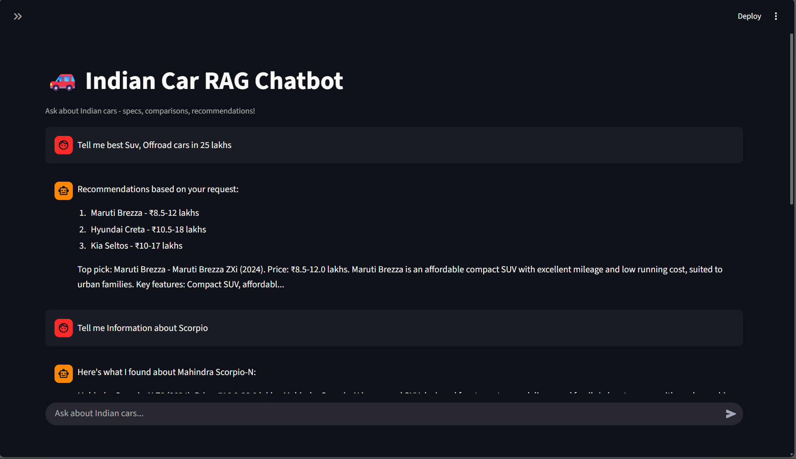
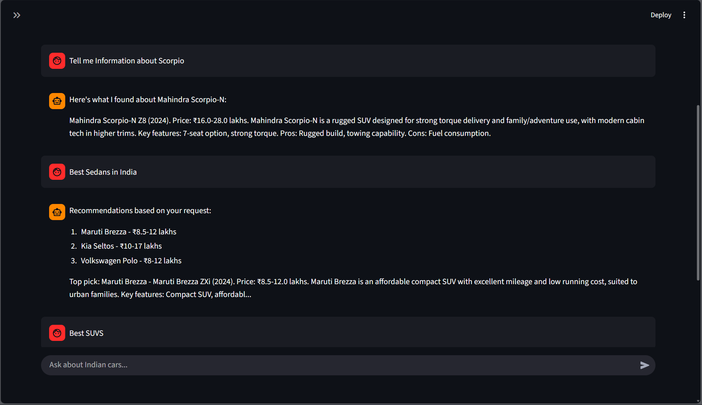
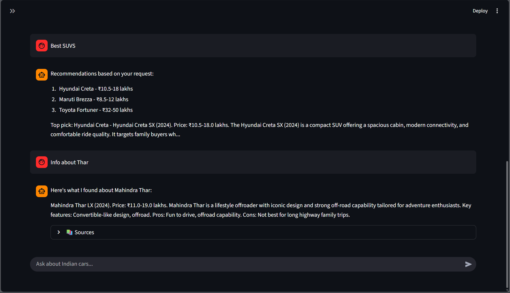

<h1 align="center">🚗 Indian Car RAG Chatbot</h1>

<p align="center">
  
  
  
  
  
  
</p>

<p align="center">
  <i>A domain-specific AI assistant for Indian automobile enthusiasts and buyers</i>
</p>

<p align="center">
  <a href="#-quick-start">🚀 Quick Start</a> •
  <a href="#-features">💡 Features</a> •
  <a href="#️-architecture">🏗️ Architecture</a> •
  <a href="#-demo">📸 Demo</a>
</p>

---

## 📋 Overview

The **Indian Car RAG Chatbot** is an intelligent AI assistant that provides deep, context-aware information about **Indian cars** using Retrieval-Augmented Generation.

Designed for:

- 🚗 Car buyers  
- ⚙️ Automobile enthusiasts  
- 🤖 Students learning RAG systems  

---

## ✨ What Makes This Special?

| Feature | Why It Matters |
|--------|----------------|
| 🏎️ **Enthusiast-First** | Deep coverage of performance cars & off-road icons |
| 🔒 **100% Local** | No API keys, no cloud, no privacy issues |
| 🧠 **Context-Aware** | Understands follow-up questions |
| ⚡ **Real-Time** | Instant RAG + embeddings |
| 🎯 **Domain-Specific** | Tuned specifically for Indian automobile market |

---

## 🏗️ Architecture

```mermaid
graph LR
    A[📱 User Query] --> B[🎨 Streamlit UI]
    B --> C[⚡ FastAPI]
    C --> D[🔤 Embeddings - MiniLM]
    D --> E[🗄️ Weaviate Vector DB]
    E --> F[🎯 Semantic Search]
    F --> G[📄 Context Retrieval]
    G --> H[💬 Response Generation]
    H --> I[🤖 Final Answer]

    J[📊 Car Dataset] --> K[🔄 Data Ingestion]
    K --> E
````

---

## 🚀 Quick Start

### ⚡ 5-Minute Setup

```bash
# Clone project
git clone <repository-url>
cd indian-car-rag-chatbot

# Create environment
python -m venv venv
venv\Scripts\activate  # Windows

# Install dependencies
pip install -r requirements.txt

# Start vector DB
docker compose up -d

# Ingest car dataset
python data/generate_cars_data.py
python src/ingestion.py

# Run backend
python api.py

# Run frontend
streamlit run streamlit_app.py
```

### Access Points

* 🌐 **Web UI** → [http://localhost:8501](http://localhost:8501)
* ⚡ **API** → [http://localhost:8000](http://localhost:8000)
* 🩺 **Health Check** → [http://localhost:8000/health](http://localhost:8000/health)

---

## 💡 Features

### 🧠 Intelligent Q&A

* “Best SUVs under 15 lakhs”
* “Compare Creta vs Seltos”
* “ADAD + sunroof cars under 20L”
* “Tell me about Gurkha’s diff-locks”

### 🔍 Advanced Search

* Semantic engine
* Synonym awareness
* Domain-trained retrieval

### 💬 Memory

* Remembers last **6 exchanges**
* Understands follow-up queries

---

## 📊 Dataset

### 🚗 Regular Cars (15 Models)

* Swift, Alto K10
* Creta, Seltos, Hector
* City, Virtus
* Nexon EV
* Harrier, Scorpio-N
* Fortuner, Brezza, Elevate

### 🏎️ Enthusiast Cars (10+)

* Gurkha, Thar
* Polo GT TSI, Octavia vRS
* Gypsy
* Abarth Punto
* BMW M340i

---

## 📁 Project Structure

```
indian-car-rag-chatbot/
├── api.py
├── streamlit_app.py
├── docker-compose.yml
├── requirements.txt
├── README.md
│
├── data/
│   ├── generate_cars_data.py
│   ├── cars_data.csv
│   └── enthusiast_cars.csv
│
├── src/
│   ├── config.py
│   ├── embeddings.py
│   ├── ingestion.py
│   ├── retriever.py
│   └── chatbot.py
│
└── screenshots/
    ├── chat1-demo.png
    ├── chat2-demo.png
    └── chat3-demo.png
```

---

## 🔌 API Endpoints

| Method | Endpoint  | Description    |
| ------ | --------- | -------------- |
| POST   | `/chat`   | Ask a question |
| GET    | `/health` | API status     |
| POST   | `/clear`  | Clear memory   |

---

## 📸 Demo

<p align="center">
  
  
  
</p>

---

## 🐛 Troubleshooting

| Issue              | Fix                           |
| ------------------ | ----------------------------- |
| Docker not running | Restart Docker Desktop        |
| Port in use        | Change 8080/8000 ports        |
| Weaviate fails     | Wait 30 seconds after startup |
| Memory issues      | Allocate 4GB+ RAM to Docker   |

---

## 🔮 Roadmap

* [ ] Car image recognition
* [ ] Market price scraping
* [ ] Voice commands
* [ ] Mobile app

---

## 👨💻 Developer

**Vedant M. Kharsekar**
AI & DS — DJSCE

---

<p align="center">
  ⭐ <b>If you like this project, consider giving it a star!</b> ⭐  
  <br><br>
  Built with ❤️ for the Indian automobile community.
</p>
```

---
